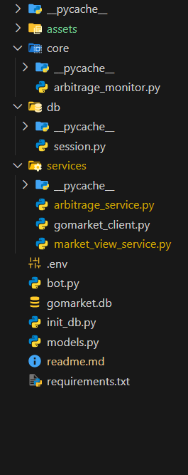
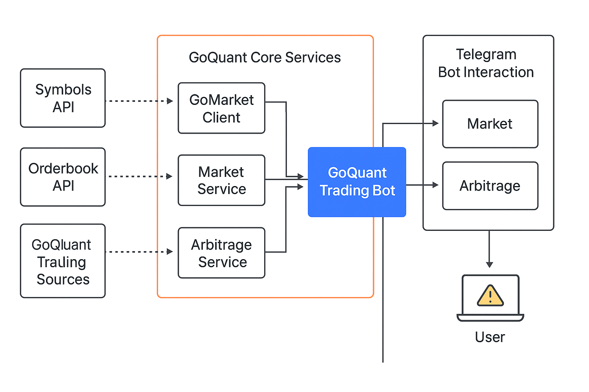

# 🤖 GoQuant Arbitrage Signal Bot

A real-time, multi-exchange arbitrage signal detector built using Python, Telegram Bot API, and GoMarket API. This bot fetches market data, detects profitable arbitrage opportunities, and pushes live alerts with professional UX directly to Telegram.

---

## 🧱 System Architecture

 




---

## 🔁 GoMarket Data Flow

- **Symbols:** Pulled dynamically from `/api/symbols/{exchange}/{market_type}`
- I have worked with SPOT as the instrument_type throughtout the assignment.
- **Orderbook:** Fetched via `/api/orderbook/{exchange}/{symbol}/{level}`
- **Usage:**
  - Symbols are parsed and normalized (BTC/USDT → BTC-USDT)
  - L1/L2 orderbooks are used to compute arbitrage and CBBO signals

Data is fetched dynamically, parsed, and normalized across all supported exchanges.

---

## 💰 Arbitrage Detection Logic
This bot detects arbitrage opportunities by comparing best bid/ask across exchanges.

### ✅ Strategy:
Buy @ Exchange A (lowest ask)
Sell @ Exchange B (highest bid)
Spread = bid - ask

### 🔍 Logic:
- Fetch L1 prices across selected exchanges
- Compute spread percentage
- If spread ≥ user-defined threshold → signal triggered

### 🏆 Output Includes:
- Buy/Sell venue
- Spread %
- Mid price
- Per-exchange best bid/ask (BBO)

## 📊 CBBO (Consolidated Best Bid/Offer)

- CBBO view shows the highest bid and lowest ask across exchanges
- Mid-price = (Best Bid + Best Ask) / 2
- Per-exchange best bid/ask data is included for transparency
- Displayed in a clean Telegram message with visual emojis and formatting

---

## 🤖 Telegram Bot UX & Commands

### 🧭 Main Menu Options:
- 📋 View Exchanges & Symbols
- 🔍 Check Arbitrage
- 📡 Monitor Arbitrage
- 💱 View Live Price (L1 Orderbook)
- ⛔ Stop / Reset

### 🔐 Command Descriptions:
- `/get_cbbo <symbol> [exchange1 exchange2 ...]`: Show CBBO and mid-price across venues
- `/monitor_arb <symbol> <threshold>`: Start live arbitrage alerts
- `/stop`: Stop all services
- `/reset`: Reset all data (DB + runtime)

### 🎯 UX Flow:
/start or menu tap
→ Choose exchange
→ Choose symbol
→ Choose threshold
→ Live arbitrage monitoring starts

yaml
Copy
Edit

- Inline buttons
- Markdown formatting
- Emojis to enhance readability

---

## 🧠 Assumptions Made about GoMarket APIs

- `/symbols/{exchange}/{market_type}` may return:
  - List of strings
  - List of objects with `name` key
  - Dict with `symbols` or `data` keys
- `/orderbook/...` returns `bids` and `asks` as lists of [price, qty]
- All symbol formats are normalized using a utility
- Exchanges supported: `okx`, `binance`, `bybit`, `deribit`
- Network failures or 500 responses are caught and logged

---

## ⚙️ Setup & Deployment

### ✅ Requirements:
- Python 3.8+
- Telegram Bot Token from [@BotFather](https://t.me/BotFather)
- Access to GoMarket backend (real or simulated)

---

### 🛠️ Installation

```bash
# Clone the repository
git clone https://github.com/yourusername/GoQuant.git
cd GoQuant

# Create and activate virtual environment
python -m venv venv
source venv/bin/activate      # On Windows: venv\Scripts\activate

# Install dependencies
pip install -r requirements.txt

Setup the .env file as follows - 
TELEGRAM_BOT_TOKEN=your_telegram_bot_token

Running the Bot
bash
Copy
Edit
# Entry point
python -m main
Use /start in your Telegram bot to interact

Set up dynamic thresholds for alerts

View L1 orderbooks or CBBO as needed

👨‍💻 Author
Tushar Jain
📧 tusharjain2308@gmail.com
🌐 Portfolio
🐙 GitHub
💼 LinkedIn
